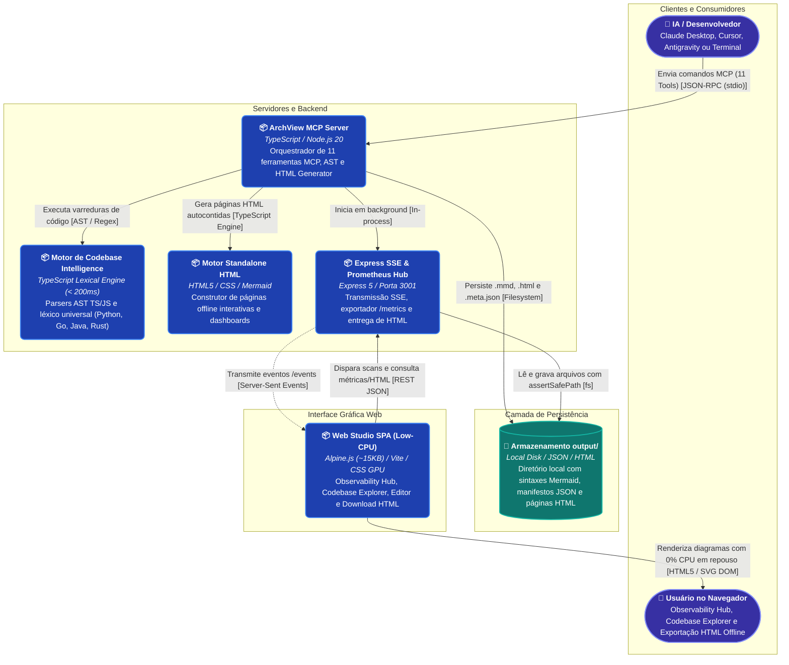
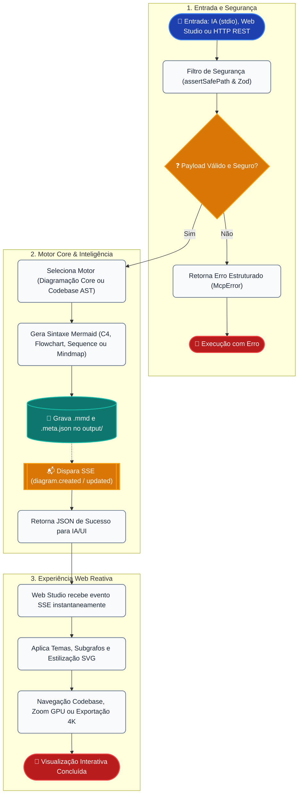

# 📐 ArchView: MCP Visual Server & Codebase Intelligence Engine v5.0

> Servidor **Model Context Protocol (MCP)** 100% local, determinístico e gratuito para análise estática de repositórios, grafos de chamadas, observabilidade Prometheus, traces OpenTelemetry, arquitetura C4, mapas mentais, organogramas e geração de HTML standalone offline.

---

## 🏛️ Visão da Arquitetura do Sistema



---

## 🌟 Funcionalidades e Recursos

```mermaid
mindmap
  root(("ArchView v5.0 Ecosystem"))
    ("🛠️ Ferramentas MCP Nativas (11 Tools)")
      generate_mindmap (Mapas Mentais Radiais)
      generate_orgchart (Organogramas Hierárquicos DFS)
      generate_architecture_diagram (Modelo C4 com Subgrafos)
      generate_flowchart (Fluxogramas e Pipelines)
      scan_codebase_topology (Topologia C4 Automática)
      trace_call_graph (Grafo Bidirecional Inbound/Outbound)
      trace_execution_flow (Sequence Diagrams de Logs)
      analyze_codebase_overview (Raio-X 360 de Repositórios)
      get_system_observability (Telemetria Prometheus & Charts)
      export_html_report (HTML Standalone e Dashboards)
      export_diagram (Exportação SVG/PNG/4K no Cliente)
    ("🌐 Geração de HTML & Dashboards (v5.0)")
      Geração automática de .html standalone por diagrama
      Dashboard executivo consolidado (All-in-One)
      100% Autocontido e offline-first (Zero Servidor)
      Pan/Zoom com aceleração por hardware
      Seletor dos 4 temas visuais e exportador PNG/SVG
    ("📈 Observabilidade e SRE")
      Endpoint /metrics no padrão texto Prometheus
      Métricas de Runtime Node.js (CPU, Heap, EventLoop)
      Histogramas de latência e contadores por diagrama
      Tracing com OpenTelemetry SDK e exportador OTLP
      Health check enriquecido com níveis de degradação
    ("🧠 Codebase Intelligence Engine")
      AST Léxica para TypeScript e JavaScript
      Parser Léxico Universal (Python, Go, Java, Rust, C#, PHP)
      Detecção de Frameworks (Express, Nest, FastAPI, Fiber)
      Resolução Determinística de Chamadas Cruzadas
      Execução instantânea (< 200ms) sem IA e sem WASM
    ("🎨 Web Studio Interativo (Low-CPU)")
      Botões de download de HTML individual e Dashboard
      Aba Observability Hub com telemetria em tempo real
      Aba Codebase Explorer com disparo de scans
      Editor Split-View com live preview
      Playground Didático MCP
    ("🛡️ Segurança e Governança")
      Anti-Path Traversal estrito (assertSafePath)
      Validação de Schemas Zod com guardrails
      Scanner SAST Local e GitHub CodeQL
      Pentest Automatizado 8 Vetores OWASP
      DOM Sanitizado sem injeção direta de HTML
```

---

## ⚡ Ciclo de Vida da Requisição e Ingestão



---

## 🚀 Como Iniciar

### 1. Instalação e Compilação
```bash
git clone https://github.com/70gurupia/archview.git
cd archview
npm install
npm run build
```

### 2. Executar Todas as Suítes de Testes
```bash
# Roda SAST, TDD, ODD, Pentest (8 vetores OWASP) e E2E:
npm test
```

### 3. Iniciar o Servidor MCP & Frontend Web
```bash
# Inicia o servidor MCP stdio + API/SSE na porta 3001:
npm start

# Ou execute o frontend em modo desenvolvimento na porta 5173:
npm run dev:frontend
```

---

## 🔌 Configuração em Clientes MCP

### Claude Desktop / Cursor / Antigravity
Adicione ao seu arquivo de configuração de servidores MCP (substitua pelo caminho do diretório onde você clonou o repositório):

```json
{
  "mcpServers": {
    "archview": {
      "command": "node",
      "args": ["/caminho/absoluto/para/archview/build/server.js"]
    }
  }
}
```

---

## 📚 Documentação Adicional

- [📖 Documentação Completa da Arquitetura](docs/ARCHITECTURE.md)
- [🗺️ Roadmap de Evolução (v3.0 Codebase Intelligence)](ROADMAP.md)
- [📚 Referência de Ferramentas e Schemas (API)](docs/API.md)
- [📋 Quadro Kanban e Backlog](KANBAN.md)
- [📈 Relatório de Progresso e Métricas](PROGRESS.md)
- [📝 Histórico de Versões (Changelog)](CHANGELOG.md)