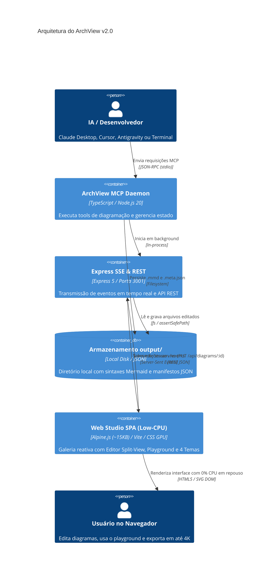
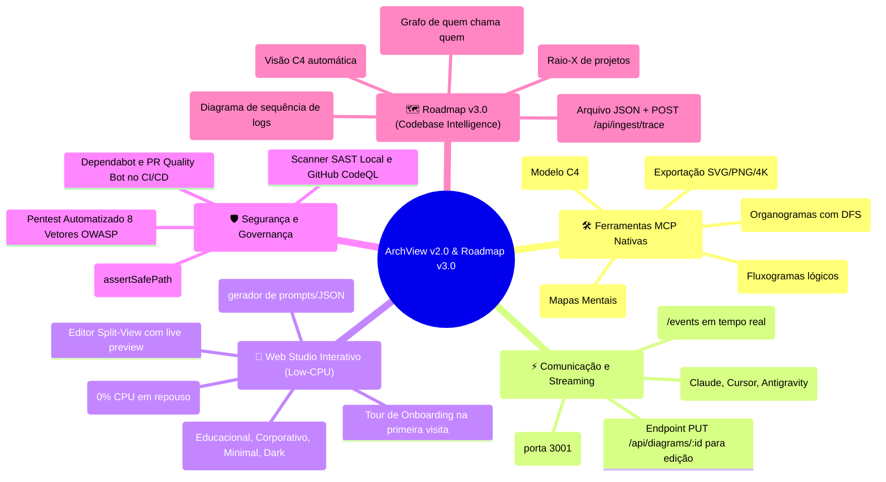
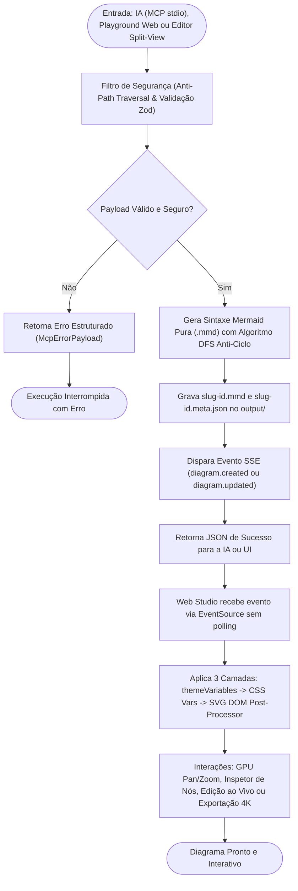

# 📐 ArchView: MCP Visual Server & Frontend Engine v2.0

> Servidor **Model Context Protocol (MCP)** 100% local, determinístico e gratuito para geração, edição ao vivo, estilização e visualização de mapas mentais, organogramas, diagramas de arquitetura (C4 Model) e fluxogramas com IA.

---

## 🏛️ Visão da Arquitetura do Sistema (Modelo C4)



---

## 🌟 Funcionalidades e Recursos



---

## ⚡ Ciclo de Vida da Requisição e Interatividade



---

## 🚀 Como Iniciar

### 1. Instalação e Compilação
```bash
git clone https://github.com/70gurupia/archview.git
cd archview
npm install
npm run build
```

### 2. Executar Todas as Suítes de Testes
```bash
# Roda SAST, TDD, ODD, Pentest (8 vetores OWASP) e E2E:
npm test
```

### 3. Iniciar o Servidor MCP & Frontend Web
```bash
# Inicia o servidor MCP stdio + API/SSE na porta 3001:
npm start

# Ou execute o frontend em modo desenvolvimento na porta 5173:
npm run dev:frontend
```

---

## 🔌 Configuração em Clientes MCP

### Claude Desktop / Cursor / Antigravity
Adicione ao seu arquivo de configuração de servidores MCP (substitua pelo caminho do diretório onde você clonou o repositório):

```json
{
  "mcpServers": {
    "archview": {
      "command": "node",
      "args": ["/caminho/absoluto/para/archview/build/server.js"]
    }
  }
}
```

---

## 📚 Documentação Adicional

- [📖 Documentação Completa da Arquitetura](docs/ARCHITECTURE.md)
- [🗺️ Roadmap de Evolução (v3.0 Codebase Intelligence)](ROADMAP.md)
- [📚 Referência de Ferramentas e Schemas (API)](docs/API.md)
- [📋 Quadro Kanban e Backlog](KANBAN.md)
- [📈 Relatório de Progresso e Métricas](PROGRESS.md)
- [📝 Histórico de Versões (Changelog)](CHANGELOG.md)