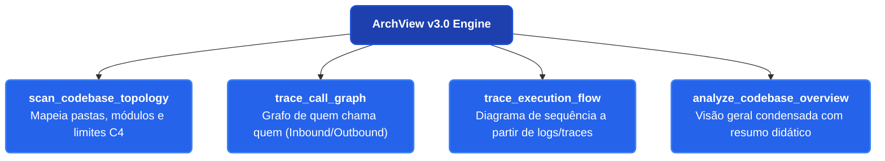

# 🗺️ Roadmap de Evolução: ArchView v3.0 (Codebase Intelligence & Flow Tracing)

> **Objetivo da v3.0:** Transformar o ArchView na ferramenta definitiva e ultra-leve para desenvolvedores compreenderem novos codebases, rastrearem dependências e visualizarem fluxos de ponta a ponta ("o que faz o que, de onde veio e para onde vai") sem a lentidão ou complexidade de bancos de grafos pesados (Neo4j, Graphify, Gephi).

---

## 🎯 Pilares da Arquitetura v3.0

1. **Ultra Low-CPU & Zero Daemons:** Toda a análise roda em memória de forma assíncrona, consumindo menos de 60MB de RAM e sem exigir Docker, bancos Neo4j ou serviços externos em segundo plano.
2. **Suporte Universal de Linguagens:** Analisadores baseados em árvores de diretórios, padrões de imports e AST leve para cobrir TypeScript, JavaScript, Python, Go, Java, Rust, PHP, C# e Elixir.
3. **Mapeamento Estático + Rastreamento Dinâmico:** Capacidade de extrair a topologia estática de pastas e componentes, além de converter logs e traces de execução em diagramas de sequência.

---

## 🛠️ Novas Ferramentas MCP Planejadas

### 1. `scan_codebase_topology`
- **Função:** Escaneia uma pasta ou repositório local e gera automaticamente um diagrama C4 Container/Component em Mermaid.
- **Saídas:** Identificação de entrypoints (APIs, CLIs, jobs), pastas de regras de negócio (serviços, controladores, repositórios) e integrações externas (bancos de dados, filas, APIs terceiras).
- **Parâmetros:**
  - `project_path`: Caminho da pasta a ser analisada.
  - `depth`: Profundidade máxima de pastas (padrão: 3).
  - `ignore_patterns`: Lista de pastas ignoradas (`node_modules`, `.git`, `dist`, `build`, `__pycache__`).

### 2. `trace_call_graph`
- **Função:** Dado um arquivo ou nome de função, rastreia quais funções ela invoca e quem a invoca.
- **Saídas:** Grafo direcionado em Mermaid (`graph LR` ou `graph TD`) destacando o ponto de partida e o fluxo de chamadas internas.
- **Parâmetros:**
  - `entry_file`: Arquivo onde a função está localizada.
  - `symbol_name`: Nome da função, método ou classe alvo.
  - `direction`: `'inbound'` (quem chama), `'outbound'` (o que ela chama) ou `'both'` (ambos).

### 3. `trace_execution_flow`
- **Função:** Converte logs estruturados, payloads de tracing OpenTelemetry (JSON/OTLP simplificado) ou stack traces em um Diagrama de Sequência interativo.
- **Saídas:** Mermaid `sequenceDiagram` demonstrando o fluxo da requisição passo a passo entre atores e microsserviços.
- **Modos de Ingestão:**
  - **Arquivo Local / Texto:** Passagem do arquivo `.json` ou log colado.
  - **Endpoint HTTP Leve:** `POST http://localhost:3001/api/ingest/trace` para receber spans de debug em tempo real.

### 4. `analyze_codebase_overview`
- **Função:** Executa um raio-x completo do repositório, combinando topologia, principais fluxos de dados e gerando um relatório didático com mapa mental e organograma de módulos.

---

## 📅 Fases de Implementação

### Fase 1: Motor Universal de Varredura Estática (v3.1)
- [ ] Implementação de analisador leve de diretórios e regex AST (`src/engine/codebase-scanner.ts`).
- [ ] Suporte a detecção automática de frameworks (Express, Nest, Django, FastAPI, Spring, Go Fiber, Next.js).
- [ ] Criação da tool `scan_codebase_topology`.

### Fase 2: Análise de Chamadas e Dependências (v3.2)
- [ ] Mapeamento de grafo de imports (`import ... from ...` e `require(...)`).
- [ ] Criação da tool `trace_call_graph`.
- [ ] Visualização interativa no Web Studio com destaque do nó selecionado.

### Fase 3: Ingestão de Tracing Dinâmico e Endpoint HTTP (v3.3)
- [ ] Endpoint `POST /api/ingest/trace` no servidor Express (porta 3001).
- [ ] Conversor de traces/spans para Mermaid Sequence Diagram (`sequenceDiagram`).
- [ ] Criação da tool `trace_execution_flow` e `analyze_codebase_overview`.

### Fase 4: Integração com o Web Studio & Exportação (v3.4)
- [ ] Nova aba no frontend: **"🔍 Codebase Explorer"**.
- [ ] Navegação em árvore de arquivos ao lado do preview do diagrama.
- [ ] Suíte completa de testes TDD, ODD e Pentest para as novas ferramentas.
