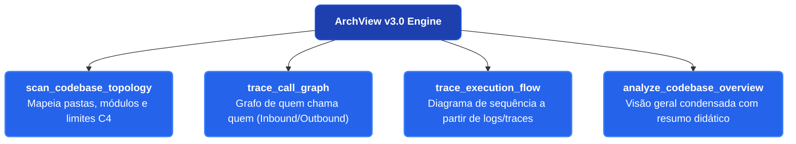

# 🗺️ Roadmap de Evolução: ArchView

> Planejamento das próximas versões do **ArchView**, priorizando melhorias visuais imediatas (Quick-Wins) antes do motor avançado de inteligência de código (v3.0).

---

## 🎨 Fase 2.5: Refinamento Visual e Semântica de Design (Quick-Wins)

> **Objetivo:** Elevar o design e a clareza visual dos diagramas gerados automaticamente para o padrão profissional moderno, com zero sobrecarga de processador.

- [ ] **TASK-014 (Design Semântico de Nós):** Integrar formas semânticas nativas do Mermaid nos geradores:
  - Cilindros `[(...)]` para bancos de dados e pastas de armazenamento.
  - Pílulas `([...])` para terminais de início/fim.
  - Losangos `{"..."}` para decisões e rotas condicionais.
  - Subprocessos `[[...]]` para filas, streaming e eventos SSE.
- [ ] **TASK-015 (Direcionamento Widescreen Inteligente):** Otimizar a direção do fluxo (`LR` horizontal para processos/pipelines em telas 16:9 e `TD` vertical para hierarquias/organogramas).
- [ ] **TASK-016 (Âncoras Visuais Padronizadas):** Inclusão automática de ícones semânticos de alto contraste (🤖 IA, ⚙️ Core, 📡 SSE, 💾 Disco, 🎨 UI, 🛡️ Segurança).
- [ ] **TASK-017 (Tipos de Conexão com Intenção):** Diferenciação de setas sólidas `-->` para fluxo síncrono, tracejadas `-.->` para eventos assíncronos e rotuladas com destaque para tratamento de erros.
- [ ] **TASK-018 (Design System com Bordas Arredondadas):** Aplicação de classes CSS com `rx:8px, ry:8px` e paleta HSL harmonizada (Azul Safira, Verde-Petróleo, Índigo e Âmbar).
- [ ] **TASK-019 (Subgrafos de Limite Arquitetural):** Agrupamento automático de blocos relacionados dentro de contêineres `subgraph` visuais.

---

## 🗺️ Fase 3.0: Codebase Intelligence & Flow Tracing (Motor Determinístico)

> **Objetivo da v3.0:** Transformar o ArchView na ferramenta definitiva e ultra-leve para desenvolvedores compreenderem novos codebases, rastrearem dependências e visualizarem fluxos de ponta a ponta ("o que faz o que, de onde veio e para onde vai") sem a lentidão ou complexidade de bancos de grafos pesados (Neo4j, Graphify, Gephi).

### 🛠️ Novas Ferramentas MCP Planejadas na v3.0

1. **`scan_codebase_topology`:** Escaneia uma pasta local e gera automaticamente um diagrama C4 Container/Component em Mermaid.
2. **`trace_call_graph`:** Rastreia a árvore de chamadas de uma função ou arquivo específico (*quem chama quem*, inbound e outbound).
3. **`trace_execution_flow`:** Converte logs estruturados, payloads de tracing ou stack traces em um Diagrama de Sequência interativo.
4. **`analyze_codebase_overview`:** Raio-X completo do repositório, combinando topologia, fluxos de dados e gerando um relatório didático com mapa mental e organograma de módulos.

---

## 📅 Cronograma de Entregas

### Etapa 1: Refinamento Visual (v2.5) — *Prioridade Imediata*
- [ ] Implementar TASK-014 a TASK-019 nos geradores e temas.
- [ ] Atualizar exemplos do Web Studio e documentação visual.

### Etapa 2: Motor Universal de Varredura Estática (v3.1)
- [ ] Implementação de analisador leve de diretórios e regex AST (`src/engine/codebase-scanner.ts`).
- [ ] Suporte a detecção automática de frameworks (Express, Nest, Django, FastAPI, Spring, Go Fiber, Next.js).
- [ ] Criação da tool `scan_codebase_topology`.

### Etapa 3: Análise de Chamadas e Dependências (v3.2)
- [ ] Mapeamento de grafo de imports (`import ... from ...` e `require(...)`).
- [ ] Criação da tool `trace_call_graph`.
- [ ] Visualização interativa no Web Studio com destaque do nó selecionado.

### Etapa 4: Ingestão de Tracing Dinâmico e Endpoint HTTP (v3.3)
- [ ] Endpoint `POST /api/ingest/trace` no servidor Express (porta 3001).
- [ ] Conversor de traces/spans para Mermaid Sequence Diagram (`sequenceDiagram`).
- [ ] Criação da tool `trace_execution_flow` e `analyze_codebase_overview`.

### Etapa 5: Integração com o Web Studio & Exportação (v3.4)
- [ ] Nova aba no frontend: **"🔍 Codebase Explorer"**.
- [ ] Navegação em árvore de arquivos ao lado do preview do diagrama.
- [ ] Suíte completa de testes TDD, ODD e Pentest para as novas ferramentas.
