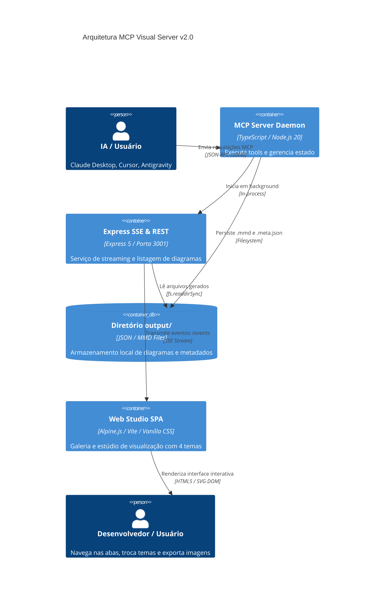
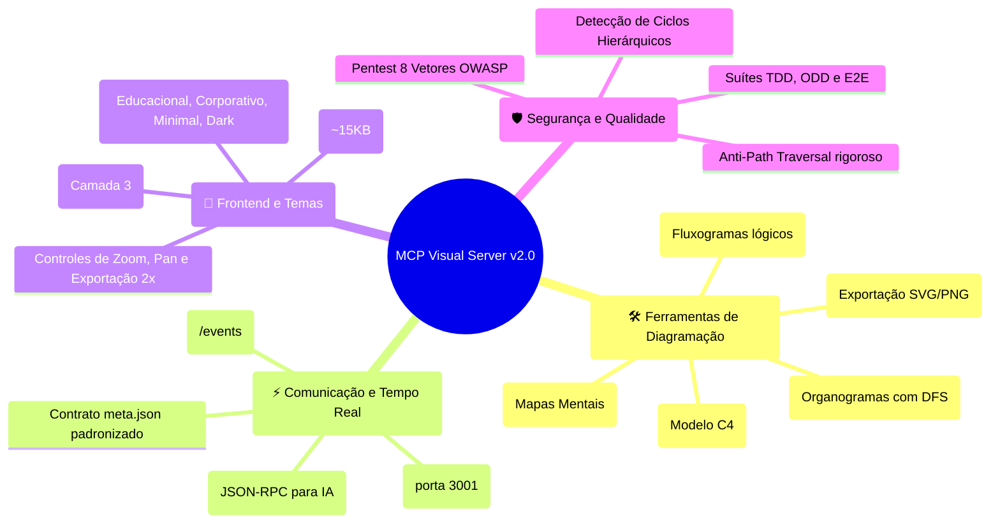
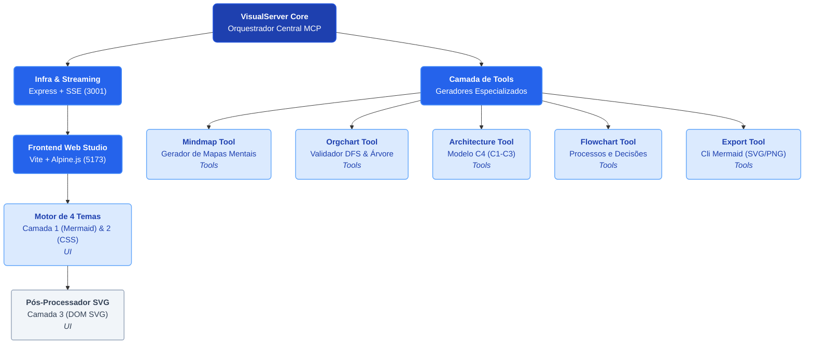
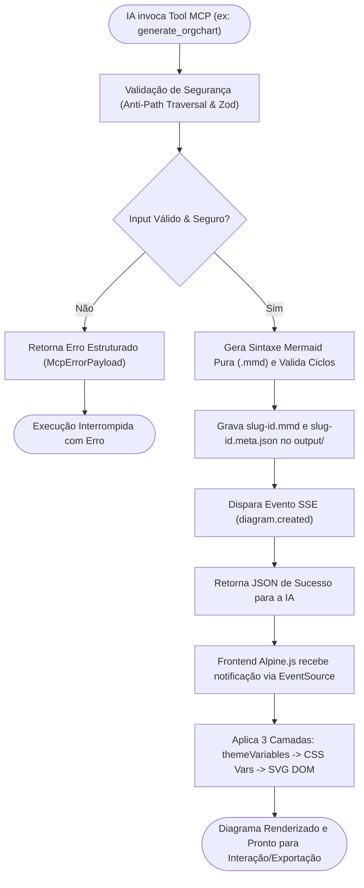

# 🏗️ Arquitetura do Sistema: MCP Visual Server v2.0

Documentação técnica da arquitetura, fluxo de dados e decisões de design do **MCP Visual Server & Frontend Engine**.

---

## 1. Visão Geral dos Containers (Modelo C4 - Nível 2)

O diagrama abaixo ilustra os containers executáveis, limites de processo e canais de comunicação do sistema:

---

## 2. Mapa Conceitual do Ecossistema

Visão completa das funcionalidades, camadas de comunicação e garantias de segurança:

---

## 3. Estrutura Modular e Hierarquia de Componentes

Organização interna dos módulos do backend e do frontend:

---

## 4. Ciclo de Vida da Requisição e Renderização em Tempo Real

Fluxo de ponta a ponta desde a chamada da ferramenta pela IA até a renderização no navegador:

---

## 5. Pipeline de Estilização em 3 Camadas

Para garantir diagramas profissionais e consistentes sem comprometer a performance em máquinas modestas, o MCP Visual Server adota uma abordagem híbrida:

1. **Camada 1 (`themeVariables`):** Injetada diretamente no parser do Mermaid (`mermaid.initialize()`), configurando cores base de nós, fontes, bordas e arestas.
2. **Camada 2 (CSS Variables):** Variáveis dinâmicas no elemento `:root` do frontend, atualizando temas da interface, botões e cartões em tempo real.
3. **Camada 3 (Pós-Processamento SVG DOM):** Manipulação pontual do SVG gerado para aplicar sombras suaves (`feDropShadow`), cantos arredondados padronizados e diferenciação semântica para elementos C4 (bancos de dados tracejados, atores com bordas arredondadas).
