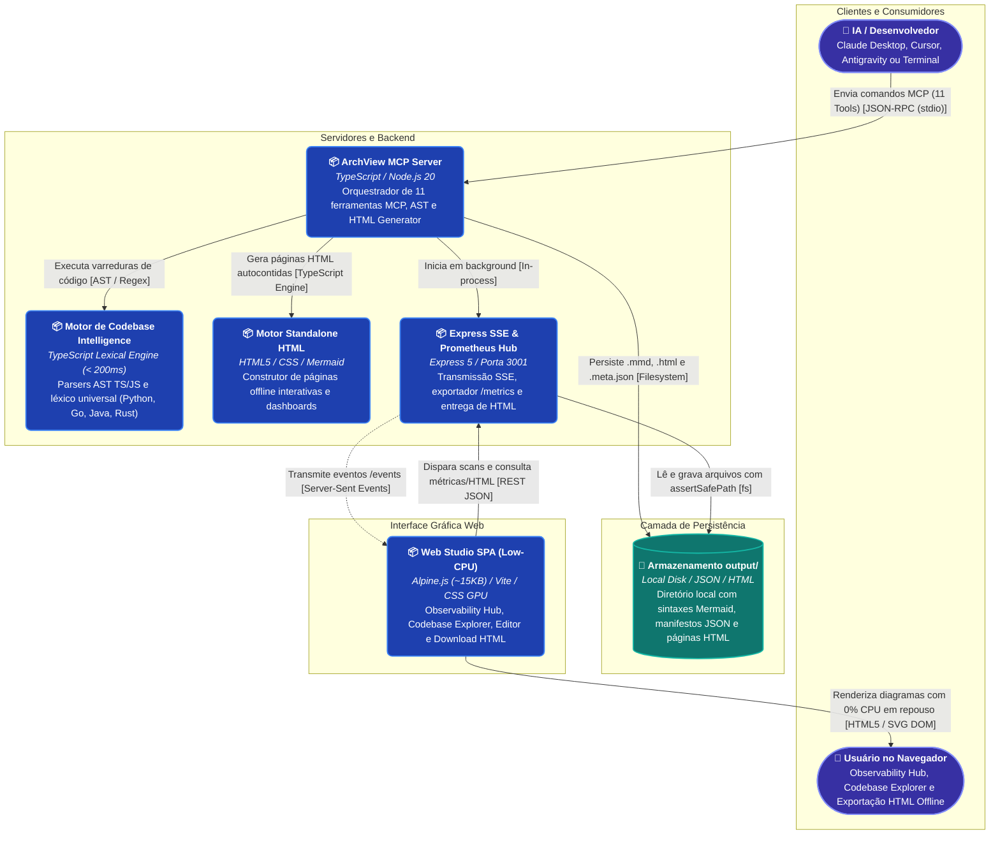
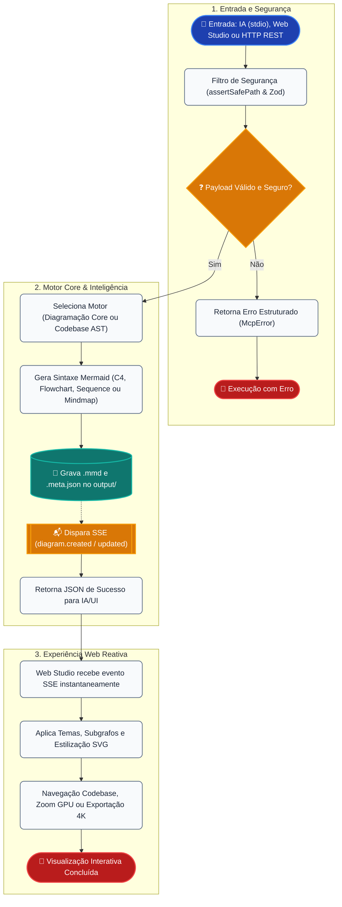

# 🏗️ Arquitetura do Sistema: ArchView v5.0 (Standalone HTML Generator & Observability Hub)

Documentação técnica da arquitetura, fluxo de dados, guardrails de segurança e subsistemas do **ArchView (MCP Visual Server, Web Studio, HTML Generator, Observability Hub & Codebase Engine)**.

---

## 1. Visão Geral da Arquitetura de Containers (C2 Container)

O diagrama abaixo ilustra os containers executáveis, limites de processo e canais de comunicação do sistema:



---

## 2. Mapa Conceitual do Ecossistema v5.0

Visão completa das funcionalidades, camadas de comunicação, garantias de segurança e recursos do motor de codebase intelligence:

```mermaid
mindmap
  root(("ArchView v5.0 Ecosystem"))
    ("🛠️ Ferramentas MCP Nativas (11 Tools)")
      generate_mindmap (Mapas Mentais Radiais)
      generate_orgchart (Organogramas Hierárquicos DFS)
      generate_architecture_diagram (Modelo C4 com Subgrafos)
      generate_flowchart (Fluxogramas e Pipelines)
      scan_codebase_topology (Topologia C4 Automática)
      trace_call_graph (Grafo Bidirecional Inbound/Outbound)
      trace_execution_flow (Sequence Diagrams de Logs)
      analyze_codebase_overview (Raio-X 360 de Repositórios)
      get_system_observability (Telemetria Prometheus & Charts)
      export_html_report (HTML Standalone e Dashboards)
      export_diagram (Exportação SVG/PNG/4K no Cliente)
    ("🌐 Geração de HTML & Dashboards (v5.0)")
      Geração automática de .html standalone por diagrama
      Dashboard executivo consolidado (All-in-One)
      100% Autocontido e offline-first (Zero Servidor)
      Pan/Zoom com aceleração por hardware
      Seletor dos 4 temas visuais e exportador PNG/SVG
    ("📈 Observabilidade e SRE")
      Endpoint /metrics no padrão texto Prometheus
      Métricas de Runtime Node.js (CPU, Heap, EventLoop)
      Histogramas de latência e contadores por diagrama
      Tracing com OpenTelemetry SDK e exportador OTLP
      Health check enriquecido com níveis de degradação
    ("🧠 Codebase Intelligence Engine")
      AST Léxica para TypeScript e JavaScript
      Parser Léxico Universal (Python, Go, Java, Rust, C#, PHP)
      Detecção de Frameworks (Express, Nest, FastAPI, Fiber)
      Resolução Determinística de Chamadas Cruzadas
      Execução instantânea (< 200ms) sem IA e sem WASM
    ("🎨 Web Studio Interativo (Low-CPU)")
      Botões de download de HTML individual e Dashboard
      Aba Observability Hub com telemetria em tempo real
      Aba Codebase Explorer com disparo de scans
      Editor Split-View com live preview
      Playground Didático MCP
    ("🛡️ Segurança e Governança")
      Anti-Path Traversal estrito (assertSafePath)
      Validação de Schemas Zod com guardrails
      Scanner SAST Local e GitHub CodeQL
      Pentest Automatizado 8 Vetores OWASP
      DOM Sanitizado sem injeção direta de HTML
```

---

## 3. Estrutura Modular e Hierarquia de Componentes

Organização interna dos módulos do backend, do estúdio web e do motor de codebase intelligence:

```mermaid
graph TD
  core["<b>ArchView Core</b><br/>Orquestrador Central MCP (stdio)"]
  engine_v3["<b>Codebase Engine (v3.0)</b><br/>AST & Flow Tracing Determinístico"]
  tools_layer["<b>Camada de Tools (9 Tools)</b><br/>Geradores Especializados com Zod"]
  infra_layer["<b>Infra & Streaming</b><br/>Express 5 + SSE Hub (3001) + Rate Limit"]
  web_studio["<b>Web Studio SPA (Low-CPU)</b><br/>Alpine.js + Vite (5173)"]
  qa_sec["<b>QA & Segurança SAST</b><br/>CodeQL, Pentest OWASP, TDD/ODD"]

  v3_ast_ts["<b>AST Parser TS/JS</b><br/>Classes, rotas e métodos<br/><i>Engine</i>"]
  v3_ast_lex["<b>Universal Lexical Parser</b><br/>Python, Go, Java, Rust, C#<br/><i>Engine</i>"]
  v3_scanner["<b>Universal Scanner</b><br/>Varredura e resolução de deps<br/><i>Engine</i>"]
  v3_trace_p["<b>Trace/Log Parser</b><br/>Transpilação para sequenceDiagram<br/><i>Engine</i>"]

  t_mind["<b>Mindmap Tool</b><br/>Mapas Mentais Radiais<br/><i>Tools</i>"]
  t_org["<b>Orgchart Tool</b><br/>Validador DFS e Árvore<br/><i>Tools</i>"]
  t_arch["<b>Architecture Tool</b><br/>Modelo C4 com Subgrafos<br/><i>Tools</i>"]
  t_flow["<b>Flowchart Tool</b><br/>Processos e Decisões<br/><i>Tools</i>"]
  t_scan_top["<b>scan_codebase_topology</b><br/>Topologia C4 de Diretórios<br/><i>Tools</i>"]
  t_trace_call["<b>trace_call_graph</b><br/>Grafo de Chamadas Bidirecional<br/><i>Tools</i>"]
  t_trace_exec["<b>trace_execution_flow</b><br/>Diagramas de Sequência<br/><i>Tools</i>"]
  t_overview["<b>analyze_codebase_overview</b><br/>Raio-X 360 do Repositório<br/><i>Tools</i>"]

  ui_explorer["<b>Codebase Explorer</b><br/>Painel de varredura e grafos<br/><i>UI</i>"]
  ui_editor["<b>Editor Split-View</b><br/>Edição ao vivo com preview<br/><i>UI</i>"]
  ui_play["<b>Playground MCP</b><br/>Gerador didático de prompts e JSON<br/><i>UI</i>"]
  ui_canvas["<b>GPU Canvas Pan/Zoom</b><br/>Aceleração por hardware CSS<br/><i>UI</i>"]
  ui_themes["<b>Motor de 4 Temas</b><br/>3 Camadas (Variables + CSS + SVG DOM)<br/><i>UI</i>"]

  core --> engine_v3
  core --> tools_layer
  core --> infra_layer
  infra_layer --> web_studio
  core --> qa_sec

  engine_v3 --> v3_ast_ts
  engine_v3 --> v3_ast_lex
  engine_v3 --> v3_scanner
  engine_v3 --> v3_trace_p

  tools_layer --> t_mind
  tools_layer --> t_org
  tools_layer --> t_arch
  tools_layer --> t_flow
  tools_layer --> t_scan_top
  tools_layer --> t_trace_call
  tools_layer --> t_trace_exec
  tools_layer --> t_overview

  web_studio --> ui_explorer
  web_studio --> ui_editor
  web_studio --> ui_play
  web_studio --> ui_canvas
  web_studio --> ui_themes

  classDef default fill:#F8FAFC,stroke:#64748B,stroke-width:1.5px,color:#1E293B,rx:6px,ry:6px;
  classDef lvl0 fill:#1E40AF,stroke:#1D4ED8,stroke-width:2px,color:#FFFFFF,rx:8px,ry:8px;
  classDef lvl1 fill:#2563EB,stroke:#3B82F6,stroke-width:2px,color:#FFFFFF,rx:6px,ry:6px;
  classDef lvl2 fill:#DBEAFE,stroke:#60A5FA,stroke-width:1.5px,color:#1E40AF,rx:6px,ry:6px;
  classDef lvl3 fill:#F1F5F9,stroke:#94A3B8,stroke-width:1.5px,color:#334155,rx:4px,ry:4px;
  class core lvl0;
  class tools_layer lvl1;
  class infra_layer lvl1;
  class web_studio lvl1;
  class qa_sec lvl1;
  class engine_v3 lvl1;
  class t_mind lvl2;
  class t_org lvl2;
  class t_arch lvl2;
  class t_flow lvl2;
  class t_exp lvl2;
  class ui_editor lvl2;
  class ui_play lvl2;
  class ui_tour lvl2;
  class ui_canvas lvl2;
  class ui_themes lvl2;
  class v3_scan lvl2;
  class v3_call lvl2;
  class v3_flow lvl2;
```



---

## 4. Ciclo de Vida da Requisição e Guardrails

Fluxo de ponta a ponta desde o acionamento (via IA ou Web Studio) até a renderização e exportação:



---

## 5. Pipeline de Estilização em 3 Camadas

1. **Camada 1 (`themeVariables`):** Injetada no parser Mermaid (`mermaid.initialize()`) para configurar as cores e fontes de base.
2. **Camada 2 (CSS Variables):** Injetada no elemento `:root` do frontend para temas e componentes reativos.
3. **Camada 3 (Pós-Processamento SVG DOM):** Injeção de sombras suaves (`feDropShadow`), bordas arredondadas e diferenciação semântica para bancos de dados, pessoas e containers.
