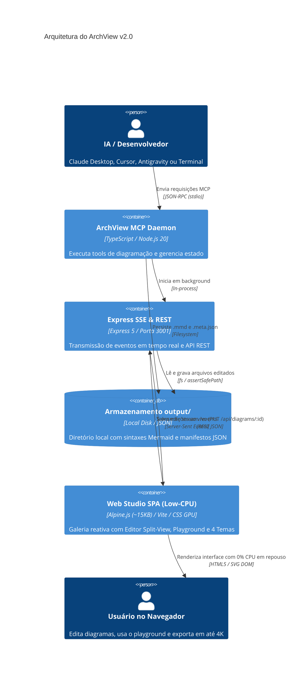
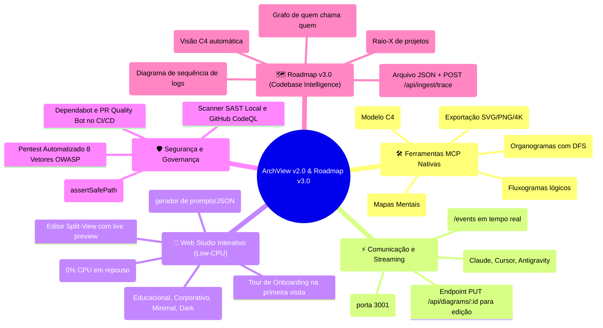
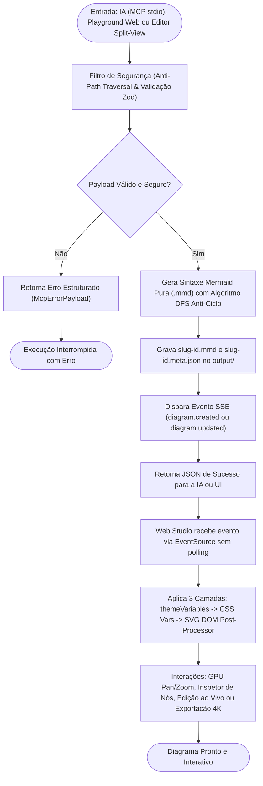

# 🏗️ Arquitetura do Sistema: ArchView v2.0 & Roadmap v3.0

Documentação técnica da arquitetura, fluxo de dados e decisões de design do **ArchView (MCP Visual Server & Web Studio)**.

---

## 1. Visão Geral dos Containers (Modelo C4 - Nível 2)

O diagrama abaixo ilustra os containers executáveis, limites de processo e canais de comunicação do sistema:

---

## 2. Mapa Conceitual do Ecossistema e Roadmap

Visão completa das funcionalidades, camadas de comunicação, garantias de segurança e o planejamento da v3.0:

---

## 3. Estrutura Modular e Hierarquia de Componentes

Organização interna dos módulos do backend, do estúdio web e do motor de codebase intelligence:

```mermaid
graph TD
  core["<b>ArchView Core</b><br/>Orquestrador Central MCP (stdio)"]
  tools_layer["<b>Camada de Tools (v2.0)</b><br/>Geradores Especializados"]
  infra_layer["<b>Infra & Streaming</b><br/>Express 5 + SSE Hub (3001)"]
  web_studio["<b>Web Studio SPA (Low-CPU)</b><br/>Alpine.js + Vite (5173)"]
  qa_sec["<b>QA & Segurança SAST</b><br/>CodeQL, Pentest OWASP, TDD/ODD"]
  engine_v3["<b>Codebase Engine (v3.0)</b><br/>AST & Flow Tracing Determinístico"]
  t_mind["<b>Mindmap Tool</b><br/>Mapas Mentais Radiais<br/><i>Tools</i>"]
  t_org["<b>Orgchart Tool</b><br/>Validador DFS e Árvore<br/><i>Tools</i>"]
  t_arch["<b>Architecture Tool</b><br/>Modelo C4 (C1-C3)<br/><i>Tools</i>"]
  t_flow["<b>Flowchart Tool</b><br/>Processos e Decisões<br/><i>Tools</i>"]
  t_exp["<b>Export Tool</b><br/>CLI Mermaid (SVG/PNG/4K)<br/><i>Tools</i>"]
  ui_editor["<b>Editor Split-View</b><br/>Edição ao vivo com preview<br/><i>UI</i>"]
  ui_play["<b>Playground MCP</b><br/>Gerador didático de prompts e JSON<br/><i>UI</i>"]
  ui_tour["<b>Tour de Onboarding</b><br/>Guia interativo de 3 passos<br/><i>UI</i>"]
  ui_canvas["<b>GPU Canvas Pan/Zoom</b><br/>Aceleração por hardware CSS<br/><i>UI</i>"]
  ui_themes["<b>Motor de 4 Temas</b><br/>3 Camadas (Variables + CSS + SVG DOM)<br/><i>UI</i>"]
  v3_scan["<b>scan_codebase_topology</b><br/>Varredura universal de pastas C4<br/><i>v3</i>"]
  v3_call["<b>trace_call_graph</b><br/>Mapeamento de chamadas e imports<br/><i>v3</i>"]
  v3_flow["<b>trace_execution_flow</b><br/>Diagramas de sequência de traces<br/><i>v3</i>"]
  core --> tools_layer
  core --> infra_layer
  infra_layer --> web_studio
  core --> qa_sec
  core --> engine_v3
  tools_layer --> t_mind
  tools_layer --> t_org
  tools_layer --> t_arch
  tools_layer --> t_flow
  tools_layer --> t_exp
  web_studio --> ui_editor
  web_studio --> ui_play
  web_studio --> ui_tour
  web_studio --> ui_canvas
  web_studio --> ui_themes
  engine_v3 --> v3_scan
  engine_v3 --> v3_call
  engine_v3 --> v3_flow

  classDef default fill:#F8FAFC,stroke:#64748B,stroke-width:1.5px,color:#1E293B,rx:6px,ry:6px;
  classDef lvl0 fill:#1E40AF,stroke:#1D4ED8,stroke-width:2px,color:#FFFFFF,rx:8px,ry:8px;
  classDef lvl1 fill:#2563EB,stroke:#3B82F6,stroke-width:2px,color:#FFFFFF,rx:6px,ry:6px;
  classDef lvl2 fill:#DBEAFE,stroke:#60A5FA,stroke-width:1.5px,color:#1E40AF,rx:6px,ry:6px;
  classDef lvl3 fill:#F1F5F9,stroke:#94A3B8,stroke-width:1.5px,color:#334155,rx:4px,ry:4px;
  class core lvl0;
  class tools_layer lvl1;
  class infra_layer lvl1;
  class web_studio lvl1;
  class qa_sec lvl1;
  class engine_v3 lvl1;
  class t_mind lvl2;
  class t_org lvl2;
  class t_arch lvl2;
  class t_flow lvl2;
  class t_exp lvl2;
  class ui_editor lvl2;
  class ui_play lvl2;
  class ui_tour lvl2;
  class ui_canvas lvl2;
  class ui_themes lvl2;
  class v3_scan lvl2;
  class v3_call lvl2;
  class v3_flow lvl2;
```

---

## 4. Ciclo de Vida da Requisição e Interatividade

Fluxo de ponta a ponta desde o acionamento (via IA ou Web Studio) até a renderização e exportação:

---

## 5. Pipeline de Estilização em 3 Camadas

1. **Camada 1 (`themeVariables`):** Injetada no parser Mermaid (`mermaid.initialize()`) para configurar as cores e fontes de base.
2. **Camada 2 (CSS Variables):** Injetada no elemento `:root` do frontend para temas e componentes reativos.
3. **Camada 3 (Pós-Processamento SVG DOM):** Injeção de sombras suaves (`feDropShadow`), bordas arredondadas e diferenciação semântica para bancos de dados, pessoas e containers.
