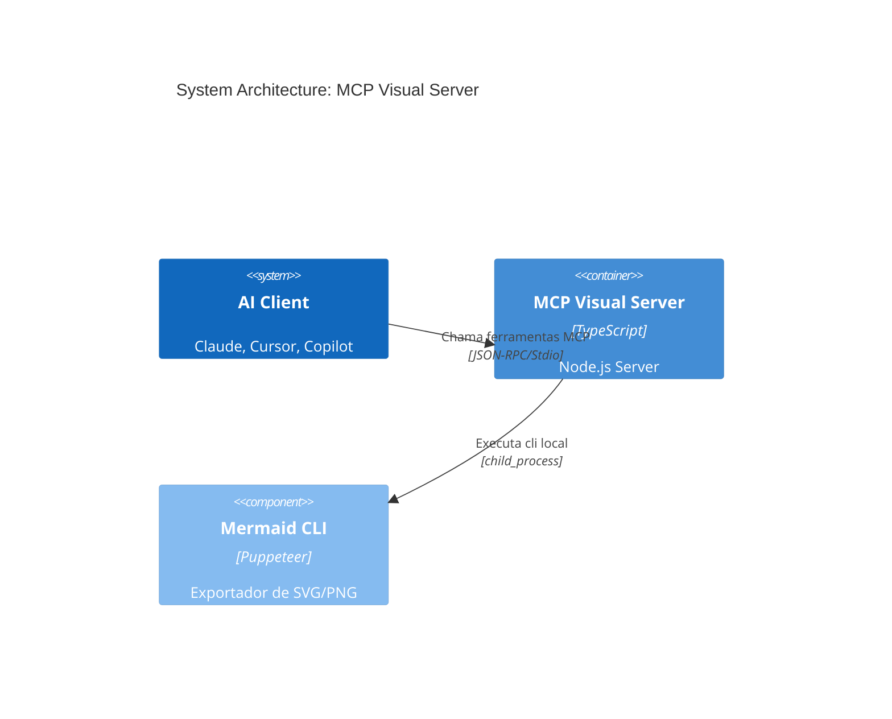

```mermaid
C4Container
  title System Architecture: MCP Visual Server
  System(ai_client, "AI Client", "Claude, Cursor, Copilot")
  Container(mcp_server, "MCP Visual Server", "TypeScript", "Node.js Server")
  Component(mermaid_cli, "Mermaid CLI", "Puppeteer", "Exportador de SVG/PNG")
  Rel(ai_client, mcp_server, "Chama ferramentas MCP", "JSON-RPC/Stdio")
  Rel(mcp_server, mermaid_cli, "Executa cli local", "child_process")
  UpdateElementStyle(person, $bgColor="#08427b", $fontColor="#ffffff", $borderColor="#052e56")

```