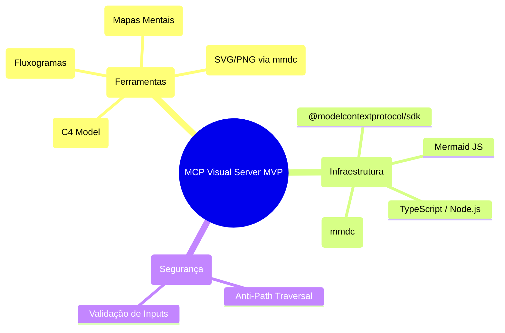

```mermaid
mindmap
  root(("MCP Visual Server MVP"))
    ("Ferramentas")
      generate_mindmap (Mapas Mentais)
      generate_architecture_diagram (C4 Model)
      generate_flowchart (Fluxogramas)
      export_diagram (SVG/PNG via mmdc)
    ("Infraestrutura")
      @modelcontextprotocol/sdk
      TypeScript / Node.js
      Mermaid JS
      Mermaid CLI (mmdc)
    ("Segurança")
      Anti-Path Traversal
      Validação de Inputs

```